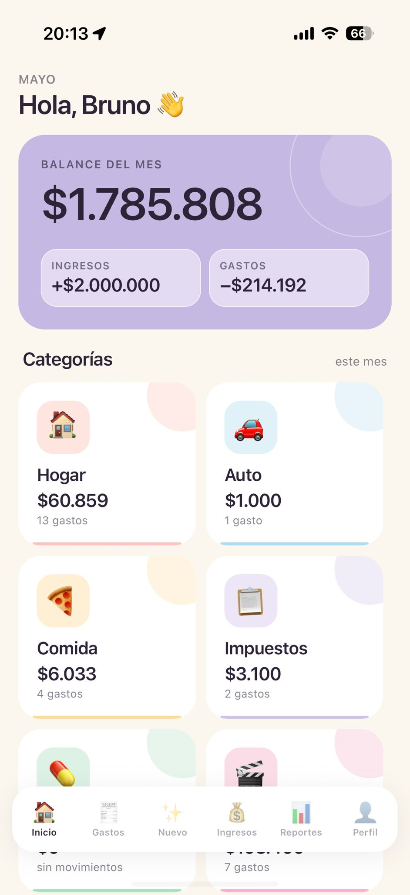
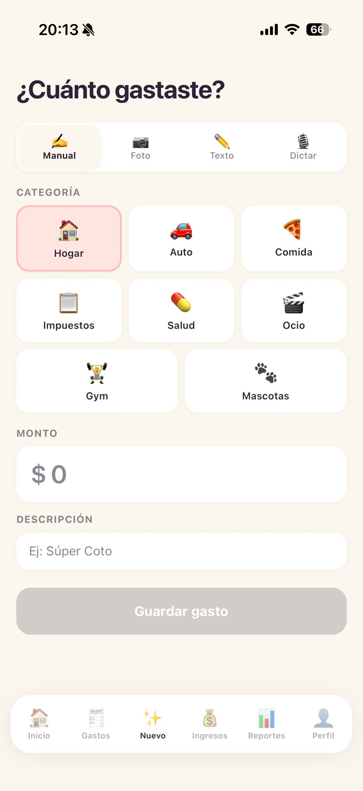
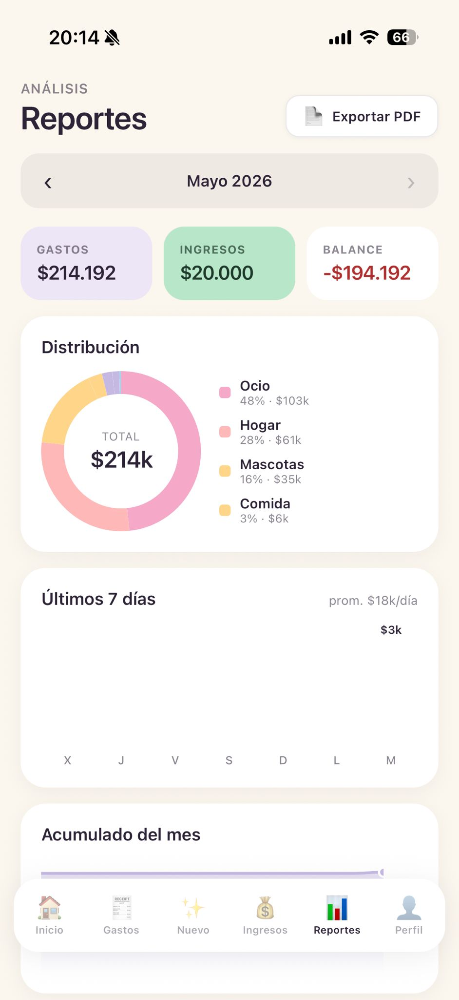

# 💸 Ya gasté

Aplicación de finanzas personales y familiares construida con **Expo + React Native**, con soporte para iOS, Android y web (desktop responsivo).

---

## Capturas

| | | |
|:---:|:---:|:---:|
| Dashboard | Gastos | Nuevo gasto |
|  |  |  |
| Ingresos | Reportes | Perfil |
|  |  |  |

## Features

- **Registro de gastos e ingresos** con categorías personalizables
- **IA integrada** - Cargá un gasto por voz o foto de ticket
- **Reportes visuales** - Gráficos de torta, barras y líneas por mes
- **Modo familiar** - Perfiles compartidos por grupo
- **Exportar PDF** - Resumen mensual listo para compartir
- **Web + desktop** - Layout responsivo con sidebar colapsable
- **Autenticación** segura vía Supabase

## Stack

| Capa | Tecnología |
|---|---|
| Framework | Expo SDK 54 / React Native 0.81 |
| Backend / Auth | Supabase |
| IA | OpenAI Whisper + GPT-4o |